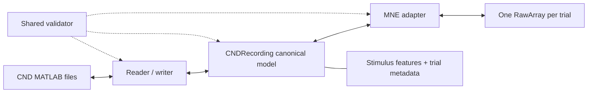

# CND-MNE Converter

Experimental bidirectional conversion between Continuous-event Neural Data
(CND) MATLAB structures and MNE-Python objects.

> [!WARNING]
> This is an early research prototype, not yet a scientifically validated
> converter. In particular, the physical units and coordinate units are absent
> from several public CND datasets and must not be guessed silently.

## Current status

The first vertical slice now provides:

- MATLAB v5 CND neural and stimulus readers;
- a canonical model that preserves variable-length trials, continuous stimulus
  features, conditions, external channels, and unknown fields;
- validation of dimensions, metadata, and synchronization in seconds;
- one MNE `RawArray` per CND neural trial;
- explicit conversion of declared EEG units to MNE's required volts;
- a conservative MNE-to-CND model adapter and atomic MATLAB writer;
- an `inspect` command; and
- synthetic CND -> MNE -> CND round-trip tests.

The prototype currently supports EEG only. MATLAB v7.3/HDF5, automatic unit
discovery, automatic coordinate scaling, external-channel typing, TRF results,
and arbitrary MNE modalities remain future work.

## Why a companion object is necessary

CND stores more than an EEG array. It can contain separate variable-length
trials, stimulus envelopes, word or note onsets, multidimensional features,
conditions, presentation order, external channels, and acquisition metadata.
A bare MNE `Raw` object cannot retain all of this information.



`MNECNDRecording` therefore contains both:

- `raws`: the MNE objects used for analysis and plotting; and
- `cnd`: the complete canonical information required for a controlled export.

## Quick start

```bash
uv sync --extra dev
uv run cnd-mne inspect /path/to/dataset/dataCND --subject 1
```

### CND to MNE

```python
from cnd_mne import read_cnd, to_mne

recording = read_cnd("/path/to/dataCND", subject=1)

# Use uV only if the dataset documentation or data owner confirms it.
mne_recording = to_mne(recording, neural_unit="uV")
first_trial = mne_recording.raws[0]
first_trial.plot()
```

The adapter does not concatenate trials or resample stimulus features. If CND
does not contain channel locations, generated names such as `EEG001` are used
and no montage is created.

### MNE to CND

```python
from cnd_mne import from_mne, write_cnd

recording = from_mne(
    mne_recording.raws,
    stimulus=mne_recording.stimulus,
    output_unit="V",
    device_name="Example device",
)
paths = write_cnd(recording, "converted/dataCND", subject=1)
```

Existing files are protected unless `overwrite=True` is passed. MNE cannot
infer speech envelopes, word onsets, conditions, or original trial order, so
these must be retained or supplied explicitly for export.

## Design rules

1. **One `RawArray` per trial.** CND trials can have different durations, while
   an MNE `Epochs` object normally requires equal-length epochs.
2. **Separate neural and stimulus clocks.** A valid dataset can store EEG at
   500 Hz and its speech envelope at 50 Hz. Alignment is checked in seconds.
3. **No automatic resampling or truncation.** Either changes scientific data
   and must be requested through a future explicit policy.
4. **No unit guessing.** MNE EEG is in volts; conversion stops when CND does not
   declare a unit and the caller does not provide one.
5. **No coordinate guessing.** Montage conversion is opt-in and requires an
   explicit scale to metres.
6. **Preserve unknown fields.** Legacy datasets contain useful experiment
   metadata outside the core specification.
7. **Protect round trips.** CND-specific information remains in the canonical
   model instead of being forced into unsuitable MNE fields.

## Repository documentation

- [Observed dataset compatibility](docs/dataset-compatibility.md)
- [Review of existing Python CND importers](docs/existing-importers.md)
- [Implementation roadmap](docs/implementation-roadmap.md)
- [Field mapping](docs/field-mapping.md)
- [ADR 0001: canonical model](docs/decisions/0001-canonical-model.md)
- [ADR 0002: trial representation](docs/decisions/0002-variable-length-trials.md)
- [ADR 0003: explicit scientific transforms](docs/decisions/0003-explicit-transforms.md)
- [ADR 0004: stimulus companion model](docs/decisions/0004-stimulus-companion.md)
- [Reference material](docs/resources.md)

## Development

```bash
uv sync --extra dev
uv run pytest
uv run ruff check .
uv run ruff format --check .
```

Large public datasets are intentionally excluded from Git. Unit tests generate
small MATLAB fixtures; full datasets are used for local integration tests and a
documented compatibility matrix.
