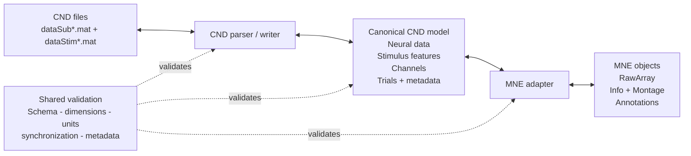

# CND-MNE Converter

Bidirectional conversion between the Continuous-event Neural Data (CND)
structure and MNE-Python objects.

> [!NOTE]
> This repository is currently in the architecture and specification phase.
> The data model and round-trip guarantees will be agreed before the converter
> implementation is finalized.

## Objective

Enable researchers to:

- analyse CND datasets with MNE-Python;
- export supported MNE data into specification-compliant CND files;
- detect data or metadata that cannot be represented without loss; and
- validate CND -> MNE -> CND round trips.

## Proposed architecture



The canonical model is intended to preserve CND-specific stimulus and trial
metadata that cannot be stored safely in a bare MNE `Raw` object.

## Planned public API

```python
recording = read_cnd("dataset/dataCND")
raws = recording.raws

write_cnd("converted/dataCND", recording)

recording = from_mne(
    raws,
    stimuli=stimuli,
    trial_metadata=trial_metadata,
)
```

The API shown above is a design proposal, not yet a stable interface.

## Success criteria

1. Imported CND neural data can be analysed and visualized with MNE.
2. Exported datasets satisfy the CND structure and synchronization rules.
3. Supported fields survive a CND -> MNE -> CND round trip.
4. Unsupported or ambiguous information produces explicit warnings rather
   than silent data loss.

## Documentation

- [Field mapping](docs/field-mapping.md)
- [Architecture decision: canonical model](docs/decisions/0001-canonical-model.md)
- [Reference material](docs/resources.md)

## Development

```bash
python -m venv .venv
source .venv/bin/activate
python -m pip install -e ".[dev]"
pytest
```

## Project status

Design phase. The next milestone is to confirm the canonical model and mapping
rules with the research team, then implement a CND reader against the Lalor
Natural Speech reference dataset.
