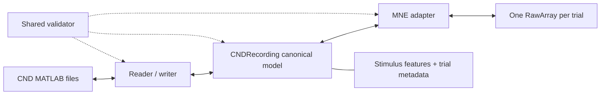

# CND-MNE Converter

Experimental bidirectional conversion between Continuous-event Neural Data
(CND) MATLAB structures and MNE-Python objects.

[](https://github.com/finnjclancy/cnd-mne-converter/actions/workflows/ci.yml)

> [!WARNING]
> This is an early research prototype, not yet a scientifically validated
> converter. In particular, the physical units and coordinate units are absent
> from several public CND datasets and must not be guessed silently.

## Current status

The tested research milestone provides:

- MATLAB v5 and v7.3/HDF5 CND neural and stimulus readers and atomic writers;
- a canonical model that preserves variable-length trials, continuous stimulus
  features, conditions, external channels, and unknown fields;
- tolerant legacy validation and strict CND 1.0 conformance validation;
- one MNE `RawArray` per CND neural trial;
- MNE `misc` views of continuous stimulus features;
- opt-in MNE annotations for explicitly selected sparse event features;
- separate, explicitly typed and scaled MNE views of external channels;
- explicit concatenation with protected trial-boundary annotations;
- explicit conversion of declared EEG units to MNE's required volts;
- fNIRS HbO/HbR conversion to MNE molar channels, with HbT retained as
  `misc` because MNE has no HbT channel type;
- template-backed MNE-to-CND export and an atomic MATLAB writer;
- `inspect` and full-dataset `verify-dataset` commands; and
- synthetic, committed MATLAB, MNE FIF, CLI, and round-trip tests.

The expanded public validation matrix covers every downloadable CND collection
linked by the official catalogue: 1,026 neural CND files across 18 report
groups. A total of 1,017 files pass structural, numerical, MNE PSD,
stimulus-view, and controlled round-trip checks over 17,774 parsed trials and
11.29 billion scalar neural values. Eight additional BabyRhythm files convert
and round-trip but contain no neural samples; they are classified as
`empty_neural_data`, not converter failures. One truncated HDF5 file in the
authoritative SparrKULee1 ZIP is the sole source-read failure. See the
machine-generated
[catalogue summary](docs/results/catalog-summary.json) and
[verification notes](docs/results/README.md) for exact claims and limitations.

The prototype currently supports EEG and the observed CND fNIRS layout.
Automatic unit discovery, automatic coordinate scaling, implicit external-
channel typing, MEG, TRF results, lazy multi-gigabyte loading, and arbitrary
MNE modalities remain future work.

## Why a companion object is necessary

CND stores more than an EEG array. It can contain separate variable-length
trials, stimulus envelopes, word or note onsets, multidimensional features,
conditions, presentation order, external channels, and acquisition metadata.
A bare MNE `Raw` object cannot retain all of this information.



`MNECNDRecording` therefore contains both:

- `raws`: the MNE objects used for analysis and plotting; and
- `cnd`: the complete canonical information required for a controlled export.

## Quick start

```bash
uv sync --extra dev
uv run cnd-mne inspect /path/to/dataset/dataCND --subject 1
```

### CND to MNE

```python
from cnd_mne import read_cnd_mne

# Use uV only if the dataset documentation or data owner confirms it.
mne_recording = read_cnd_mne("/path/to/dataCND", subject=1, neural_unit="uV")
first_trial = mne_recording.raws[0]
first_trial.plot()
```

The adapter does not concatenate trials or resample stimulus features. If CND
does not contain channel locations, generated names such as `EEG001` are used
and no montage is created.

### Stimulus features and explicit concatenation

```python
# The speech envelope keeps the stimulus sampling rate and arbitrary units.
envelope_trials = mne_recording.stimulus_raws("Speech Envelope Vectors")

# Sparse word-onset vectors can be explicitly exposed as annotations.
word_events = mne_recording.stimulus_annotations("Word Onsets")

# External channels remain separate and require an explicit unit and type.
mastoids = mne_recording.external_raws(
    unit="uV", channel_names=("M1", "M2"), channel_types="eeg"
)

# This is opt-in. MNE boundary annotations protect every artificial join.
continuous_view = mne_recording.concatenate()
print(mne_recording.trial_slices)
```

### MNE to CND

```python
# Filtering can modify the MNE values without changing trial length.
mne_recording.raws[0].filter(1, 15)

# The source template retains stimulus features and CND-only metadata.
paths = mne_recording.write_cnd(
    "converted/dataCND", subject=1, output_unit="uV", mat_version="7.3"
)
```

Existing files are protected unless `overwrite=True` is passed. MNE cannot
infer speech envelopes, word onsets, conditions, or original trial order, so
use template-backed export after importing CND. For MNE data created elsewhere,
`from_mne(...)` constructs a new CND recording and reports unsupported metadata.

### Verify a complete dataset

```bash
uv run cnd-mne verify-dataset /path/to/dataset \
  --neural-unit uV \
  --output verification.json
```

The unit is mandatory for MNE checks when a legacy file omits it. Supply only a
unit confirmed by the dataset owner. Use `--strict-spec` when validating newly
created CND data against the published CND 1.0 rules.

For fNIRS, MNE stores haemoglobin concentrations in molar (`M`) units. The
reader combines CND's `datatype x trial` cells into one MNE trial while
retaining the block sizes needed to reconstruct the original CND layout.

## Design rules

1. **One `RawArray` per trial.** CND trials can have different durations, while
   an MNE `Epochs` object normally requires equal-length epochs.
2. **Preserve legacy clocks and report conformance.** CND 1.0 requires equal
   neural and stimulus rates, but AliceSpeech stores 500 Hz and 50 Hz. Tolerant
   mode preserves both clocks and warns; strict mode rejects the mismatch.
3. **No automatic resampling or truncation.** Either changes scientific data
   and must be requested through a future explicit policy.
4. **No unit guessing.** MNE EEG is in volts and fNIRS concentrations are in
   molar units; conversion stops when CND does not declare a unit and the
   caller does not provide one.
5. **No coordinate guessing.** Montage conversion is opt-in and requires an
   explicit scale to metres.
6. **Preserve unknown fields.** Legacy datasets contain useful experiment
   metadata outside the core specification.
7. **Protect round trips.** CND-specific information remains in the canonical
   model instead of being forced into unsuitable MNE fields.

## Repository documentation

- [Observed dataset compatibility](docs/dataset-compatibility.md)
- [Research milestone report](docs/research-milestone-report.md)
- [Full-dataset verification evidence](docs/results/README.md)
- [Testing strategy and coverage interpretation](docs/testing-strategy.md)
- [Public test-dataset release and checksums](docs/dataset-assets.md)
- [Review of existing Python CND importers](docs/existing-importers.md)
- [Implementation roadmap](docs/implementation-roadmap.md)
- [Scientific validation checklist](docs/scientific-validation-checklist.md)
- [Questions for CND and MNE maintainers](docs/questions-for-maintainers.md)
- [Field mapping](docs/field-mapping.md)
- [ADR 0001: canonical model](docs/decisions/0001-canonical-model.md)
- [ADR 0002: trial representation](docs/decisions/0002-variable-length-trials.md)
- [ADR 0003: explicit scientific transforms](docs/decisions/0003-explicit-transforms.md)
- [ADR 0004: stimulus companion model](docs/decisions/0004-stimulus-companion.md)
- [Reference material](docs/resources.md)

## Development

```bash
uv sync --extra dev
uv run pytest --cov=cnd_mne
uv run ruff check .
uv run ruff format --check .
```

Large public datasets are intentionally excluded from Git history. They are
available from their original public sources; committed checksum manifests
record the exact files used for local integration tests. CI uses the small,
committed and regeneratable MATLAB fixture under `tests/data/`.
