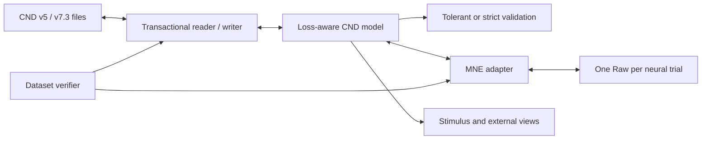

# Research milestone: tested CND-MNE interoperability

## Outcome

The project provides bidirectional, metadata-aware interoperability between
CND MATLAB datasets and MNE-Python. It has been exercised against every
downloadable collection linked by the public CND catalogue, not only synthetic
arrays. It is ready for technical review; unqualified scientific use still
requires confirmation of units, coordinate semantics, and experiment-specific
alignment.

## Architecture

The CND model remains alongside the MNE objects because a bare `Raw` cannot
losslessly hold separate stimulus clocks, variable-length trials, conditions,
presentation order, rejected trials, external groups, and arbitrary MATLAB
extension fields.

## Engineering delivered

- MATLAB v5 and v7.3/HDF5 neural and stimulus readers and transactional writers.
- EEG plus the fNIRS HbO/HbR/HbT layout observed in the catalogue.
- Explicit physical-unit conversion to MNE SI units; no unit guessing.
- Opt-in EEGLAB coordinate transform requiring a scale to metres.
- One MNE `RawArray` per variable-length neural trial.
- Continuous stimulus views, opt-in sparse-event annotations, and explicitly
  typed/scaled external-channel views.
- Boundary-protected concatenated views for workflows requiring one timeline.
- Template-backed MNE-to-CND export preserving CND-only metadata.
- Tolerant legacy validation and strict CND 1.0 conformance validation.
- Reproducible full-dataset reports and explicit outcome classifications.
- Optional v5/v7.3 serialized verification through the actual writer and reader.
- CI across Linux, macOS, Windows, supported Python versions, and minimum/latest
  compatible MNE versions.
- Release metadata, licence, citation, contribution and security guidance.

## Public-catalogue results

| Measure | Result |
| --- | ---: |
| Dataset report groups | 18 |
| Non-empty neural CND files | 1,026 |
| Complete end-to-end passes | 1,017 |
| Structurally valid files with no neural samples | 8 |
| Upstream source-read failures | 1 |
| Parsed trials | 17,774 |
| Neural time samples | 204,719,481 |
| Scalar neural values | 11,293,937,597 |
| Maximum CND-to-MNE numerical error | 0 |
| Maximum controlled round-trip numerical error | 0 |
| Automated tests | 110 passing |
| Statement coverage | 96.23% |

Every complete pass includes MATLAB parsing, structural validation, MNE object
construction, orientation and value comparison, all stimulus views, a finite
MNE Welch PSD, a template-backed round trip, and CND metadata preservation.

The eight all-empty BabyRhythm files also parse and round-trip but cannot run a
brain-signal analysis. They are `empty_neural_data`, not converter errors. The
only unreadable file is a physically truncated HDF5 file inside the published
SparrKULee1 archive.

## What this establishes

- All layouts observed in the linked catalogue are understood or explicitly
  classified.
- Trial orientation, order, lengths, clocks, and numerical values are retained.
- Supported CND metadata survives controlled MNE processing and export.
- MNE can perform a real spectral computation on every non-empty passing file.
- Empty and corrupt inputs are distinguished from converter defects.

## What remains scientifically unresolved

- Most public files do not declare their real EEG unit. The catalogue scan used
  a recorded identity-test assumption to detect software mapping errors.
- Coordinate unit, axes, origin, and frame need maintainer confirmation.
- Padding, surplus samples, attended/unattended alternatives, and external
  channel semantics need experiment-owner confirmation.
- An independent MATLAB/NAPlib/Eelbrain comparison is needed for one reference
  dataset using confirmed scientific units and coordinates.
- The public API needs review by the CND and MNE maintainers before an upstream
  proposal.
- MEG, automatic alignment/resampling, lazy multi-gigabyte access, and TRF
  result interchange remain separate future work.

## Recommended next milestone

Select one well-understood dataset and subject, confirm its units and montage,
compare it independently with the original analysis workflow, and obtain
maintainer sign-off on the resulting plots and values. Then open an MNE design
discussion using the tested companion-object API as the concrete proposal.

Detailed evidence is under [full-dataset results](results/README.md), with the
remaining decisions in [questions for maintainers](questions-for-maintainers.md)
and the step-by-step [scientific validation checklist](scientific-validation-checklist.md).
