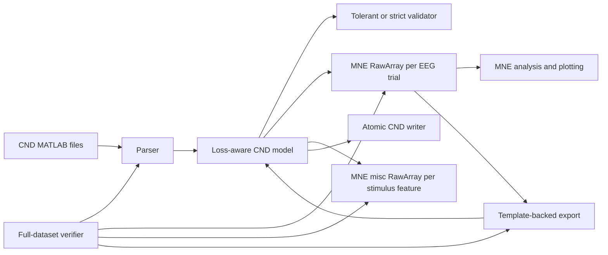

# Research milestone: tested CND-MNE interoperability

## Outcome

The project now demonstrates bidirectional, metadata-aware interoperability
between legacy CND MATLAB datasets and MNE-Python. The implementation has been
tested against six public CND archives, not only synthetic arrays.

The current milestone is suitable for technical review and discussion with the
CND and MNE maintainers. It is not yet suitable for unqualified scientific use
because the public archives do not declare EEG units or coordinate units.

## Implemented architecture



The complete CND model remains alongside MNE objects. This is necessary because
speech envelopes, word onsets, conditions, presentation order, external
channels, and experiment-specific MATLAB fields do not all have standardized
homes in a bare MNE `Raw` object.

## Engineering delivered

- MATLAB v5 and read-only MATLAB v7.3/HDF5 CND neural and stimulus reader.
- Atomic writer with preflight protection against partial multi-file output.
- Numeric `cndVersion` preservation.
- Restoration of one-channel matrices squeezed by MATLAB/SciPy loading.
- Explicit EEG unit conversion to MNE's volts.
- Opt-in EEGLAB coordinate transform with an explicit scale to metres.
- One MNE `RawArray` per variable-length neural trial.
- Separate MNE `misc` views for arbitrary stimulus feature sets.
- Optional concatenated neural view with MNE `BAD boundary`, `EDGE boundary`,
  and `CND_TRIAL/*` annotations.
- Template-backed MNE-to-CND export that preserves CND-only metadata.
- Warnings or errors when MNE metadata has no standardized CND mapping.
- Tolerant legacy validation and strict CND 1.0 conformance validation.
- Reproducible full-dataset JSON verifier and command-line interface.
- A committed, regeneratable MATLAB CND fixture and FIF interoperability test.
- Automated CI across Python 3.10, 3.12, and 3.13.

## Experimental method and results

The six downloaded datasets were read one subject at a time. For each subject,
the verifier constructed MNE neural objects, compared every MNE sample with its
CND source value, constructed MNE views of all stimulus features, computed a
Welch PSD through MNE, exported through the source CND template, and compared
the returned neural values and metadata.

| Measure | Result |
| --- | ---: |
| Public datasets | 6 |
| Non-empty subject files | 142 |
| Empty archive placeholders skipped and reported | 1 |
| Neural trials | 3,008 |
| Neural time samples | 38,380,840 |
| Scalar neural values | 3,320,880,928 |
| Failed subjects | 0 |
| Non-finite MNE PSD checks | 0 |
| Maximum CND-to-MNE numerical error | 0 |
| Maximum MNE-to-CND numerical error | 0 |
| Automated tests | 82 passing |
| Statement coverage | 98.13% |

The detailed evidence is stored under [results](results/README.md). The current
automated suite contains synthetic, malformed-input, committed-MATLAB-fixture,
MNE FIF, CLI, validation, and round-trip tests.

## What the result proves

- The implemented parser understands all observed layouts in the six public
  archives.
- Trial arrays are transposed into MNE correctly.
- The converter retains variable trial lengths without padding.
- Stimulus features remain on their own clocks and values.
- MNE can perform a real spectral computation on the converted neural data.
- Supported neural values and CND metadata survive the controlled round trip.

## What the result does not prove

- The public EEG values are in volts. `V` was deliberately used as an identity
  transform for software verification only.
- The public electrode coordinates are in metres or a confirmed head frame.
- Large duration discrepancies in Lalor are scientifically intended.
- Every CND dataset in existence follows one of the six observed layouts.
- MATLAB v7.3/HDF5 writing, MEG, fNIRS, and TRF result files are not supported
  yet.

## Questions for the supervisor / maintainers

1. What physical EEG unit applies to each public dataset?
2. Should `dataUnit` and coordinate-unit fields become required CND metadata?
3. Are the long Lalor neural trials intentional, and how should padding or
   surplus samples be represented?
4. Should an upstream MNE reader return a specialized companion object, a list
   of `Raw` objects, or a concatenated view with boundaries?
5. Should stimulus features remain a companion collection, or should MNE gain
   a domain-specific container for continuous naturalistic features?
6. How should AAD attended and unattended stimulus files be paired?

## Reproduce locally

```bash
uv sync --extra dev
uv run pytest --cov=cnd_mne
uv run ruff check .
uv run ruff format --check .

uv run cnd-mne verify-dataset /path/to/LalorNatSpeech \
  --neural-unit V \
  --output lalor-report.json
```

For scientific conversion, replace `V` only with a unit confirmed by the data
owner or dataset documentation.
